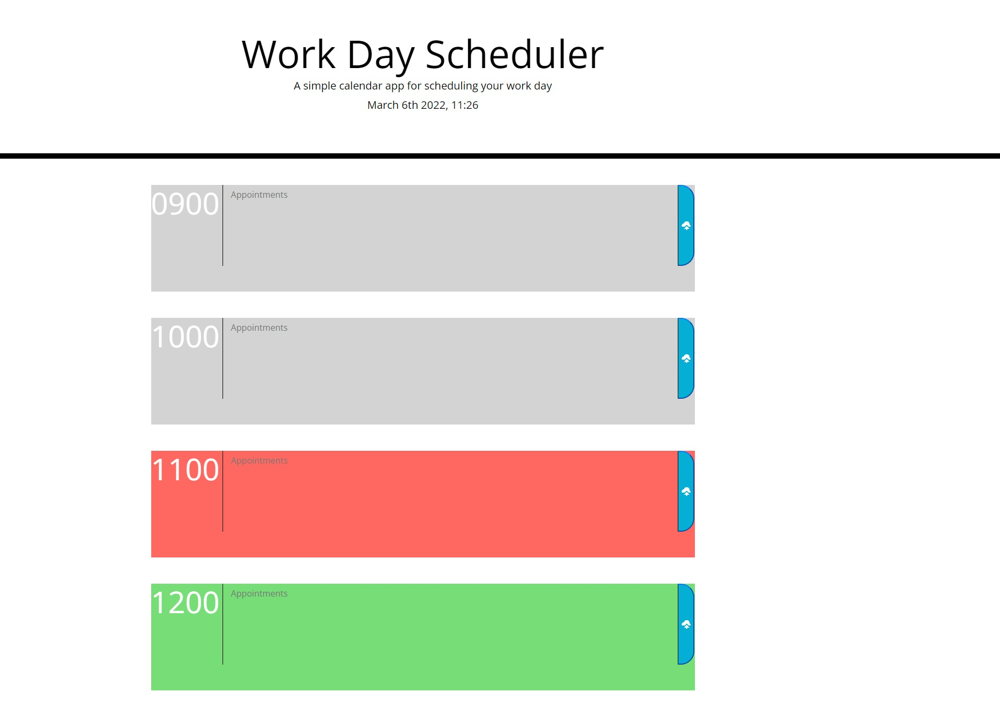

# What-am-I-doing-today?

## Desription: 
Use this simple Work Day Scheduler to plan out your tasks! Super simple and easy to understand, just enter your appointments, events, etc in the corresponding time slot, hit the cloud upload button to the right and your appointment is saved and will be waiting if you close out your browser and come back later. Also you'll be able to tell right away what upcoming appointments you have based on the color coded format.

* Gray time slots are long gone.
* Red time slots are probably going to need your attention right away!
* Green time slots are what you have coming up so start prepping!

## Technical Note
Due to me being from a military town and being associated with the military for my entire life through family, time slots are based on a 24hr clock cycle. So to help you understand if you are unfamiliar with a 24hr clock I will give some examples:

- 0900 = 9:00am
- 1000 = 10:00am
- 1100 = 11:00am

As you can see up until noon it's exactly the same BUT after that is where it gets tricky!

- 1300 = 1:00pm
- 1400 = 2:00pm
- 1500 = 3:00pm

It's all pretty straight forward once you get used to it! 

This site was made using [GitHub Pages](https://ejimenez22.github.io/What-am-I-doing-today-/)

